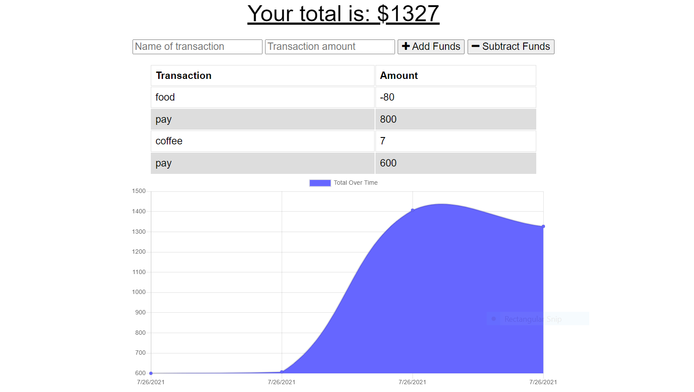
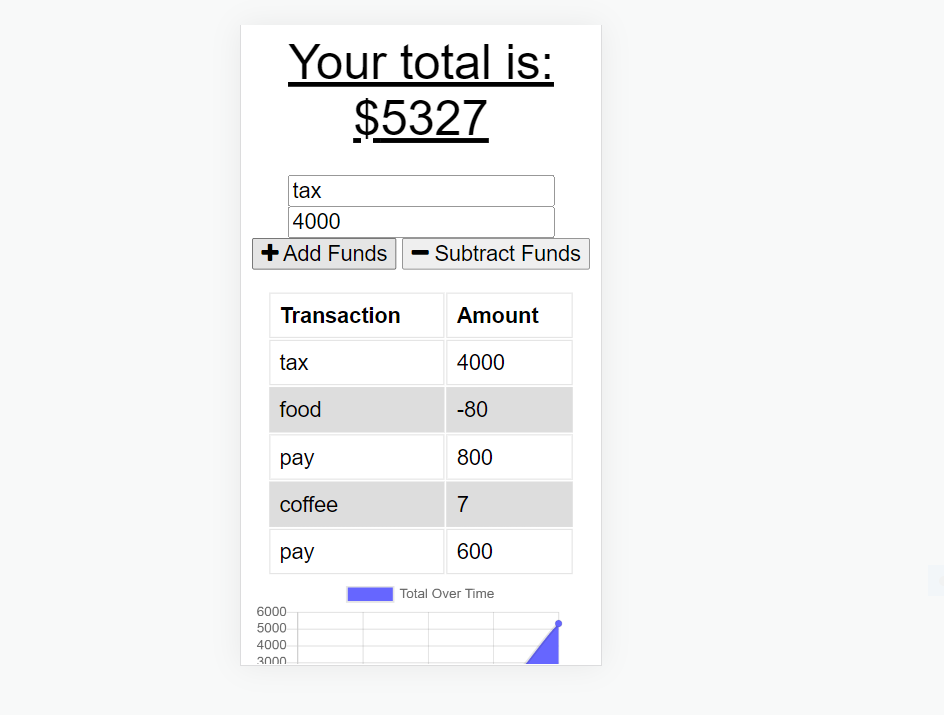

# PWA-Budget-Tracker

## Description

For the nineteenth week of UNH-CODING-BOOTCAMP, the goal was to add functionality to a budget tracker app to allow for users to access it while offline. The user is able to add or subtract funds while offline and their expenses update once back online.

 

## Table of Contents

- [Installation](#installation)
- [Screenshot](#screenshot)
- [GitHub](#Github)
- [Credits](#credits)
- [License](#license)

 

## Installation
- Clone the respositry from Github to your local machine 
- Open up your preferred terminal and navigate to the directory where you cloned the github repository
- Run in the terminal:
- npm install
- Run npm start on the root in your terminal
- Open localhost 3000 OR ->
- Navigate to Heroku to see it live there

 

## Dependancies to Install
- compression
- express
- lite-server
- mongoose
- morgan

 

## Usage

Open a browser and search for localhost:3000
Open with Heroku link below and view the deployed application

 

## Screenshot
 
 )
 

 
 

## Github Repository
[Github](https://github.com/efagioli01/PWA-Budget-Tracker)

 

## Heroku

[Heroku](https://polar-beyond-70024.herokuapp.com/)

 

## Credits

Collaborators - Swetha Redivari [Github](https://github.com/swethareddyl)

UNH Full Stack Coding Book Camp partnered with Trilogy Education Services

Course Instructor - Gabe Perry

Course TA - Andrew Hatfield

Tutor - Morgan Splawn

 

## MIT License

Copyright (c) [2021] [Erica Fagioli] 

Permission is hereby granted, free of charge, to any person obtaining a copy
of this software and associated documentation files (the "Software"), to deal
in the Software without restriction, including without limitation the rights
to use, copy, modify, merge, publish, distribute, sublicense, and/or sell
copies of the Software, and to permit persons to whom the Software is
furnished to do so, subject to the following conditions:

The above copyright notice and this permission notice shall be included in all
copies or substantial portions of the Software.

THE SOFTWARE IS PROVIDED "AS IS", WITHOUT WARRANTY OF ANY KIND, EXPRESS OR
IMPLIED, INCLUDING BUT NOT LIMITED TO THE WARRANTIES OF MERCHANTABILITY,
FITNESS FOR A PARTICULAR PURPOSE AND NONINFRINGEMENT. IN NO EVENT SHALL THE
AUTHORS OR COPYRIGHT HOLDERS BE LIABLE FOR ANY CLAIM, DAMAGES OR OTHER
LIABILITY, WHETHER IN AN ACTION OF CONTRACT, TORT OR OTHERWISE, ARISING FROM,
OUT OF OR IN CONNECTION WITH THE SOFTWARE OR THE USE OR OTHER DEALINGS IN THE
SOFTWARE.
